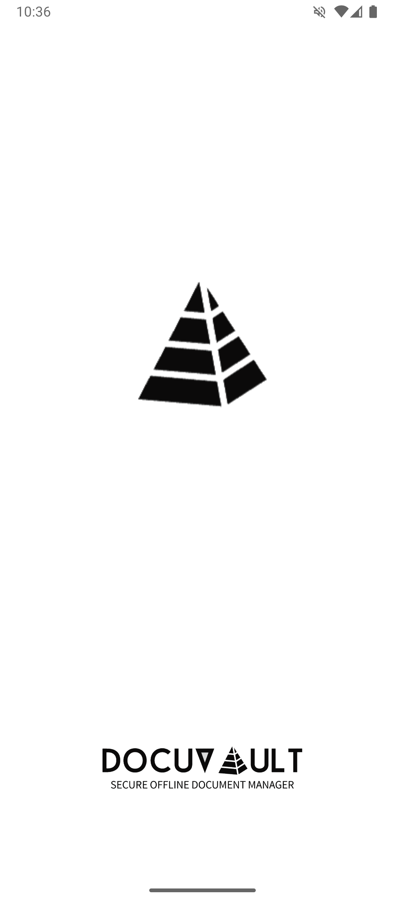
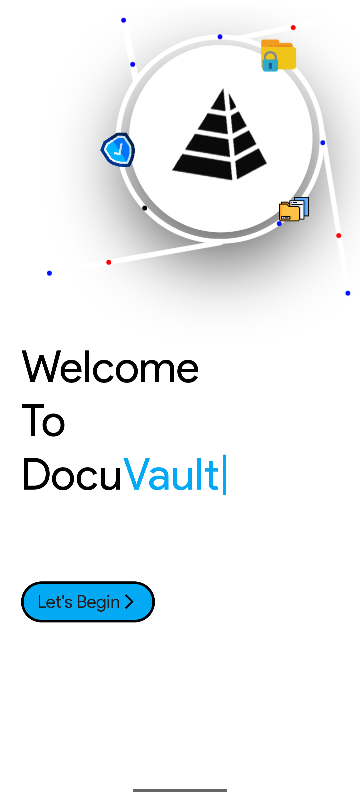
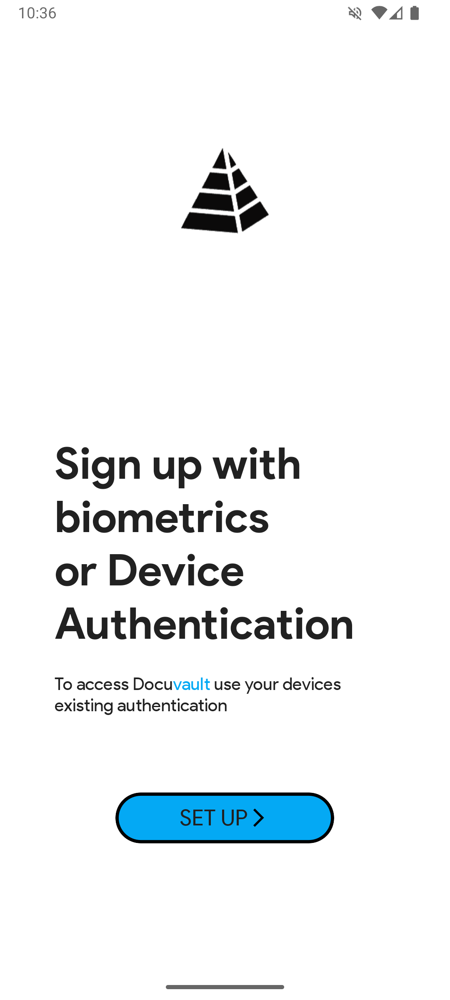
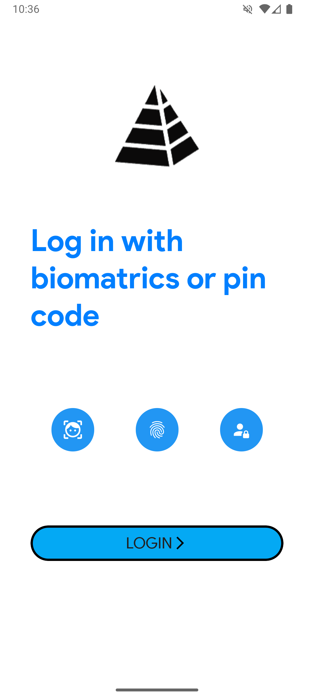
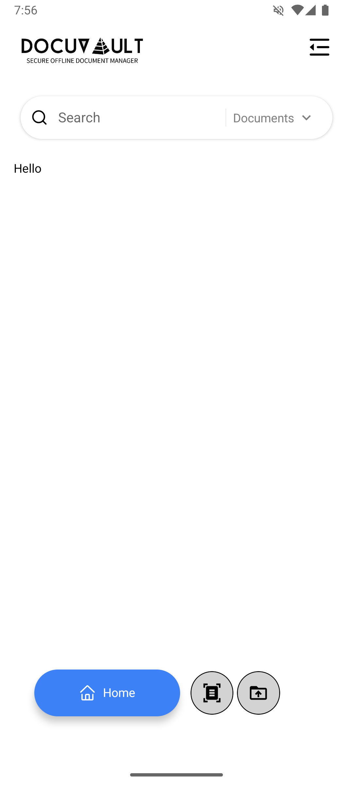

# 🔐 DocuVault

**DocuVault** is a secure, offline-first document vault built with React Native. It helps you store, organize, and manage your sensitive documents like IDs, certificates, and bills — all on your device, privately and securely.

## 📸 Screenshots

||||||

## 🎥 GIF

  

---

## ✨ Features

- 🔒 **Biometric Lock** (Fingerprint / PIN)
- 🗂️ **Categorized Document Storage**
- 📂 **Add via File Picker or Camera Scan**
- 🔎 **OCR Search + Tag Filtering**
- 📅 **Reminders & Notes**
- 📤 **Secure Share & Export**
- 🌓 **Dark & Light Mode**
- 🛡️ **Offline-First & Encrypted**

---

## 🛠 Tech Stack

- React Native (Expo)
- MMKV Storage (Secure Offline)
- Redux Toolkit
- React Navigation
- Custom Hooks & Modular Design
- ICONS - Feather / Ionicons / Material Icons

---
